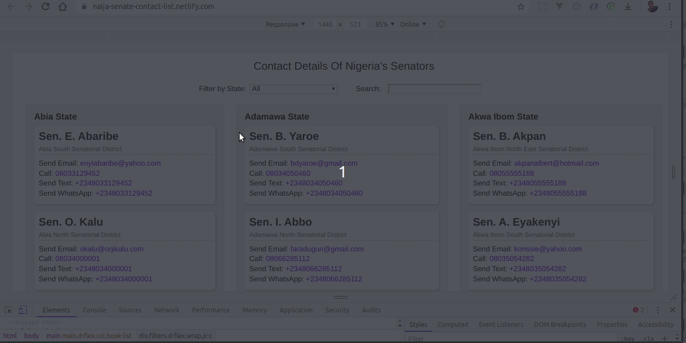

# [naija-senate-contact-list.netlify.com](https://naija-senate-contact-list.netlify.com/) &middot; [](https://codeclimate.com/github/bolah2009/naija-senate-contact-list/maintainability) [](https://travis-ci.org/bolah2009/naija-senate-contact-list) []()

# Nigeria Senate List (The 9th Assembly)

A Progressive web app (PWA) with list of the 9th Assembly senators and their contacts in Nigeria.

## 🌐 [Live link](https://naija-senate-contact-list.netlify.com/)

## 🖼️ Screenshot



## 🛠️ Development (Running locally)

- Clone the project

```bash
git clone https://github.com/bolah2009/naija-senate-contact-list.git

```

- Install Dependencies

```bash
yarn install
```

To run ESLint by itself, you may run the lint task:

```bash
yarn lint:check
```

Or to automatically fix issues found (where possible):

```bash
yarn lint
```

You can also check against Prettier:

```bash
yarn format:check
```

and to have it actually fix (to the best of its ability) any format issues, run:

```bash
yarn format
```

- Start server (Development mode)

```bash
yarn start
```

- Start server (Production mode)

```bash
yarn build
```

## 🧾 TODO

- Add more template options for messaging senator
- Add script for scrape data on directly from [NASS Website](https://www.nassnig.org/mps/senators) to update data.
- Improve UI/UX

## 🤝🏾 Contributing

Contributions, issues and feature requests are welcome!

Feel free to check the [issues page](../../issues).

## ⭐️ Show your support

Give a ⭐️ if you like this project!

## 🙏🏾 Acknowledgments

- [NASS](https://www.nassnig.org/mps/senators)
- [Shine Your Eye](https://www.shineyoureye.org/position/senator/)
- [Village Parrot](https://twitter.com/VillageParrot/status/1197802164263030784)

## 👨🏽‍💻 Author

- [@bolah2009](https://github.com/bolah2009/)

## 📝 License

[MIT licensed](./LICENSE).
